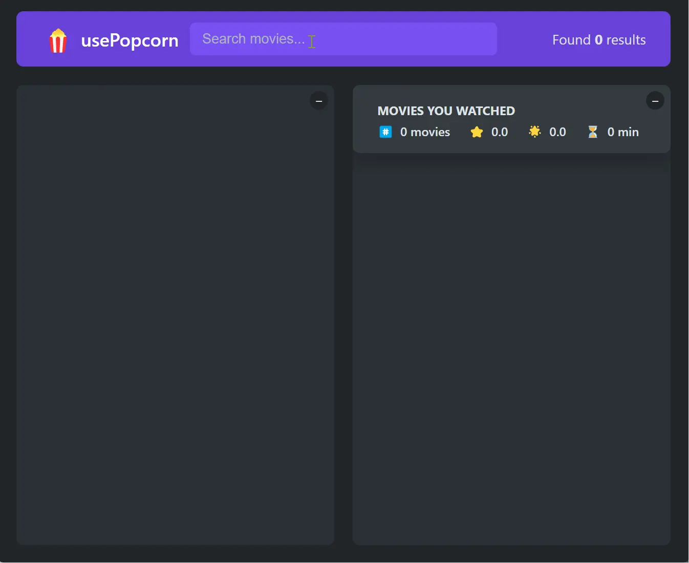

### 👋 **I am Erhan ERTEM**

&emsp;

## Udemy The Ultimate React Course 2024: React, Redux & More by Jonas Schmedtmann

### **Objective:** Create a Use-Popcorn App

- Props, prop drilling
- Component design, composition, and reusability
- Custom hooks
- Key prop
- useEffect usage
  - AbortController premature fetch request termination
  - Fetch error handling, loading state
  - Cleanup for eventlisteners
- useRef usage
  - JSX DOM element manipulation
  - Data mutation across re-renders
- useState usage
  - Initialize a state with a callback

In addition to the curriculum:

- Setup API and client hosting separetly on render.com
  - Included dotenv via webpack configuration for React App (node_env url setting switching)
  - Created a mini backend to serve API access with dotenv API secret
- More flexible useKey custom Hook for multiple key entries
- Fix null fetched IMDB rating causing NaN average rating error

&emsp;

###### ⚠️Free-tier render services may experience throttling, leading to delayed app loading times. Since the API and client are hosted separately, getting the backend online may take additional time to respond due to enforced spin-downs on free-tier services.

####  [Use-PopCorn App](https://app-usepopcorn-erhan-ertem.onrender.com)

---

